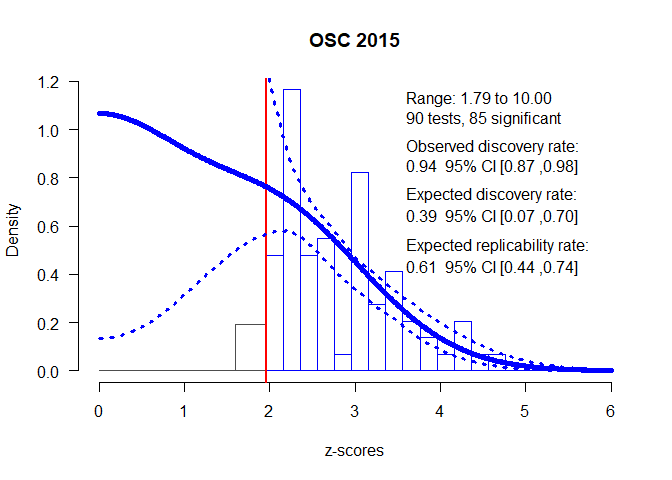

<!-- README.md is generated from README.Rmd. Please edit that file -->

# zcurve

<!-- badges: start -->

[](https://travis-ci.com/FBartos/zcurve)
<!-- badges: end -->

This package implements z-curves - methods for estimating expected
discovery and replicability rates on bases of test-statistics of
published studies. The package provides functions for fitting the new
density and EM version (Bartoš & Schimmack, in preparation) as well as
the original density z-curve (Brunner & Schimmack, 2020). Furthermore,
the package provides summarizing and plotting functions for the fitted
z-curve objects. See the aforementioned articles for more information
about the z-curves, expected discovery and replicability rates,
validation studies, and limitations.

## Installation

You can install the current version of zcurve from CRAN with:

``` r
install.packages("zcurve")
```

or the development version from [GitHub](https://github.com/) with:

``` r
# install.packages("devtools")
devtools::install_github("FBartos/zcurve")
```

## Example

Z-curve can be used to estimate expected replicability rate (ERR) and
expected discovery rate (EDR) using z-scores from a set of significant
findings. This is a reproduction of an example in Bartoš and Schimmack
(in preparation) where the z-curve is used to estimate ERR and EDR on a
subset of studies used in reproducibility project (OSC, 2015). Only
studies with non-ambiguous original outcomes are used - excluding
studies with “marginally significant” original findings, leading to 90
studies. Out of these 90 studies, 35 were successfully replicated.

We included the recoded z-scores from the 90 OSC studies as a dataset in
the package (‘OSC.z’). The expectation-maximization (EM) version of the
z-curve is implemented as the default method and can be fitted (with
1000 bootstraps) and summarized using ‘zcurve and ’summary’ functions.

The first argument to the function call is a vector of z-scores.
Alternatively, a vector of two-sided p-values can be also used, by
specifying “zcurve(p = p.values)”.

``` r
set.seed(666)
library(zcurve)
#> Please, note the following changes in version 1.0.9 (see NEWS for more details):
#> - The ERR estimate now takes the directionality of the expected replications into account, which might lead to slight changes in the estimates.

fit <- zcurve(OSC.z)

summary(fit)
#> Call:
#> zcurve(z = OSC.z)
#> 
#> model: EM via EM
#> 
#>     Estimate  l.CI  u.CI
#> ERR    0.615 0.443 0.740
#> EDR    0.388 0.070 0.699
#> 
#> Model converged in 27 + 783 iterations
#> Fitted using 73 z-values. 90 supplied, 85 significant (ODR = 0.94, 95% CI [0.87, 0.98]).
#> Q = -60.61, 95% CI[-72.24, -46.24]
```

More details from the fitted object can be extracted from the fitted
object. For more statistics, as expected number of conducted studies,
the file drawer ratio or Sorić’s FDR specify ‘all = TRUE’.

``` r
summary(fit, all = TRUE)
#> Call:
#> zcurve(z = OSC.z)
#> 
#> model: EM via EM
#> 
#>               Estimate  l.CI   u.CI
#> ERR              0.615 0.443  0.740
#> EDR              0.388 0.070  0.699
#> Soric FDR        0.083 0.023  0.705
#> File Drawer R    1.574 0.430 13.387
#> Expected N         219   122   1223
#> Missing N          129    32   1133
#> 
#> Model converged in 27 + 783 iterations
#> Fitted using 73 z-values. 90 supplied, 85 significant (ODR = 0.94, 95% CI [0.87, 0.98]).
#> Q = -60.61, 95% CI[-72.24, -46.24]
```

For more information regarding the fitted model weights add ‘type =
“parameters”’.

``` r
summary(fit, type = "parameters")
#> Call:
#> zcurve(z = OSC.z)
#> 
#> model: EM via EM
#> 
#>   Mean  Weight  l.CI  u.CI
#> 1 0.000  0.056 0.000 0.445
#> 2 1.000  0.005 0.000 0.374
#> 3 2.000  0.734 0.002 0.999
#> 4 3.000  0.205 0.000 0.640
#> 5 4.000  0.000 0.000 0.000
#> 6 5.000  0.000 0.000 0.000
#> 7 6.000  0.000 0.000 0.000
#> 
#> Model converged in 27 + 783 iterations
#> Fitted using 73 z-values. 90 supplied, 85 significant (ODR = 0.94, 95% CI [0.87, 0.98]).
#> Q = -60.61, 95% CI[-72.24, -46.24]
```

The package also provides a convenient plotting method for the z-curve
fits.

``` r
plot(fit)
```


The default plot can be further modified by using classic R plotting
arguments as ‘xlab’, ‘ylab’, ‘main’, ‘cex.axis’, ‘cex.lab’. Furthermore,
an annotation with the main test statistics can be added to the plot by
specifying ‘annotation = TRUE’ and the pointwise confidence intervals of
the plot by specifying “CI = TRUE”. For more options regarding the
annotation see ’?plot.zcurve".

``` r
plot(fit, CI = TRUE, annotation = TRUE, main = "OSC 2015")
```



Other versions of the z-curves may be fitted by changing the method
argument in the ‘zcurve’ function. Set ‘method = “density”’ to fit the
new version of z-curve using density method (KD2). The original version
of the density method as implemented in Brunner and Schimmack (2020) can
be fitted by adding ‘list(model = “KD1”)’ to the ‘control’ argument of
‘zcurve’.

(We omit bootstrapping to speed the fitting process in this case)

``` r
fit.KD2 <- zcurve(OSC.z, method = "density", bootstrap = FALSE)
fit.KD1 <- zcurve(OSC.z, method = "density", control = list(model = "KD1"), bootstrap = FALSE)

summary(fit.KD2)
#> Call:
#> zcurve(z = OSC.z, method = "density", bootstrap = FALSE)
#> 
#> model: KD2 via density
#> 
#>     Estimate
#> ERR    0.613
#> EDR    0.506
#> 
#> Model converged in 47 iterations
#> Fitted using 73 z-values. 90 supplied, 85 significant (ODR = 0.94, 95% CI [0.87, 0.98]).
#> RMSE = 0.11

summary(fit.KD1)
#> Call:
#> zcurve(z = OSC.z, method = "density", bootstrap = FALSE, control = list(model = "KD1"))
#> 
#> model: KD1 via density (version 1)
#> 
#>     Estimate
#> ERR    0.634
#> 
#> Model converged in 141 iterations
#> Fitted using 73 z-values. 90 supplied, 85 significant (ODR = 0.94, 95% CI [0.87, 0.98]).
#> MAE (*1e3) = 0.25
```

The ‘control’ argument can be used to change the number of iterations or
reducing the convergence criterion in cases of non-convergence. It can
be also used for constructing custom z-curves by changing the location
of the mean components, their number or many other settings. However, it
is important to bear in mind that those custom models need to be
validated first on simulation studies prior to their usage. For more
information about the control settings see ‘?control\_EM’,
‘?control\_density’, and ‘?control\_density\_v1’.

If you encounter any problems or bugs, please, contact me at
f.bartos96\[at\]gmail.com or submit an issue at
<https://github.com/FBartos/zcurve/issues>. If you like the package and
use it in your work, please, cite it as:

``` r
citation(package = "zcurve")
#> 
#> To cite the zcurve package in publications use:
#> 
#> Bartoš F, Schimmack U (2020). "zcurve: An R Package for Fitting
#> Z-curves." R package version 1.0.8, <URL:
#> https://CRAN.R-project.org/package=zcurve>.
#> 
#> A BibTeX entry for LaTeX users is
#> 
#>   @Misc{,
#>     title = {zcurve: An R Package for Fitting Z-curves},
#>     author = {František Bartoš and Ulrich Schimmack},
#>     year = {2020},
#>     note = {R package version 1.0.8},
#>     url = {https://CRAN.R-project.org/package=zcurve},
#>   }
```

## Sources

Bartoš, F., & Schimmack, U. (2020, January 10). Z-Curve.2.0: Estimating
Replication Rates and Discovery Rates.
<https://doi.org/10.31234/osf.io/urgtn>

Brunner, J., & Schimmack, U. (2020). Estimating population mean power
under conditions of heterogeneity and selection for significance.
Meta-Psychology, 4.

Open Science Collaboration. (2015). Estimating the reproducibility of
psychological science. Science, 349(6251), aac4716.
