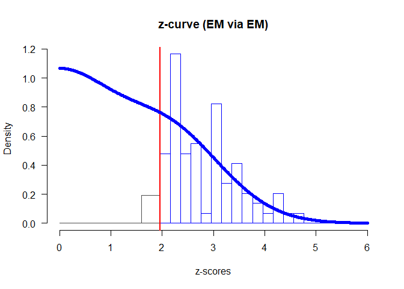

<!-- README.md is generated from README.Rmd. Please edit that file -->

# zcurve

<!-- badges: start -->

[](https://travis-ci.com/FBartos/zcurve)
<!-- badges: end -->

This package implements z-curves - methods for estimating expected
discovery and replicability rates on bases of test-statistics of
published studies. The package provides functions for fitting the new
density and EM version (Bartoš & Schimmack, in preparation) as well as
the original density z-curve (Brunner & Schimmack, 2019). Furthermore,
the package provides summarizing and plotting functions for the fitted
z-curve objects. See the aforementioned articles for more information
about the z-curves, expected discovery and replicability rates,
validation studies, and limitations.

## Installation

You can install the released version of zcurve from
[CRAN](https://CRAN.R-project.org) with:

``` r
install.packages("zcurve")
```

And the development version from [GitHub](https://github.com/) with:

``` r
# install.packages("devtools")
devtools::install_github("FBartos/zcurve")
```

## Example

Z-curve can be used to estimate expected replicability rate (ERR) and
expected discovery rate (EDR) using z-scores from a set of significant
studies. This is a reproduction of an example in Bartoš and Schimmack
(in preparation) where the z-curve is used to estimate ERR and EDR on a
subset of studies used in reproducibility project (OSC, 2015). Only
studies with non-ambiguous original outcomes are used - excluding
studies with “marginally significant” original findings, leading to 90
studies. Out of these 90 studies, 35 were successfully replicated.

We included the recoded z-scores from the 90 OSC studies as a dataset in
the package (‘OSC.z’). The Expectation Maximization (EM) version of the
z-curve is implemented as the default method and can be fitted (with
1000 bootstraps) and summarized using ‘zcurve and ’summary’ functions.

``` r
library(zcurve)

fit <- zcurve(OSC.z)

summary(fit)
#> Call:
#> zcurve(z = OSC.z)
#> 
#> model: EM7 via EM
#> 
#>     Estimate  l.CI  u.CI
#> ERR    0.616 0.448 0.747
#> EDR    0.448 0.072 0.700
#> 
#> Model converged in 59 + 63 iterations
#> Q = -60.62, 95% CI[-70.68, -46.54]
```

More details from the fitted object can be extracted from the fitted
object. For more statistics, as expected number of conducted studies,
the file drawer ratio or Sorić’s FDR specify ‘all = TRUE’.

``` r
summary(fit, all = TRUE)
#> Call:
#> zcurve(z = OSC.z)
#> 
#> model: EM7 via EM
#> 
#>               Estimate  l.CI   u.CI
#> ERR              0.616 0.448  0.747
#> EDR              0.448 0.072  0.700
#> Soric FDR        0.065 0.023  0.674
#> File Drawer R    1.233 0.428 12.800
#> Expected N         190   121   1173
#> Missing N         -100 -1083    -31
#> 
#> Model converged in 59 + 63 iterations
#> Q = -60.62, 95% CI[-70.68, -46.54]
```

For more information regarding the fitted model weights add ‘type =
“parameters”’.

``` r
summary(fit, type = "parameters")
#> Call:
#> zcurve(z = OSC.z)
#> 
#> model: EM7 via EM
#> 
#>   Mean  Weight  l.CI  u.CI
#> 1 0.000  0.021 0.000 0.428
#> 2 1.000  0.069 0.000 0.440
#> 3 2.000  0.697 0.001 0.998
#> 4 3.000  0.213 0.000 0.643
#> 5 4.000  0.000 0.000 0.000
#> 6 5.000  0.000 0.000 0.000
#> 7 6.000  0.000 0.000 0.000
#> 
#> Model converged in 59 + 63 iterations
#> Q = -60.62, 95% CI[-70.68, -46.54]
```

The package also provides a convenient plotting method for the z-curve
fits.

``` r
plot(fit)
```



The default plot can be further modified by using classic R plotting
arguments as ‘xlab’, ‘ylab’, ‘main’, ‘cex.axis’, ‘cex.lab’. Furthermore,
an annotation with the main test statistics can be added to the plot by
specifying ‘annotation = TRUE’ and the piece-wise confidence intervals
of the plot by specifying “CI = TRUE”. For more options regarding the
annotation see ’?plot.zcurve".

``` r
plot(fit, CI = TRUE, annotation = TRUE, main = "OSC 2015")
```


Other versions of the z-curves may be fitted by changing the method
argument in the ‘zcurve’ function. Set ‘method = “density”’ to fit the
new version of z-curve using density method (KD2). The original version
of the density method as implemented in Brunner and Schimmack (2019) can
be fitted by adding ‘list(model = “KD1”)’ to the ‘control’ argument of
‘zcurve’.

(We omit the bootstrap to speed the fitting case in this case)

``` r
fit.KD2 <- zcurve(OSC.z, method = "density", bootstrap = FALSE)
fit.KD1 <- zcurve(OSC.z, method = "density", control = list(model = "KD1"), bootstrap = FALSE)

summary(fit.KD2)
#> Call:
#> zcurve(z = OSC.z, method = "density", bootstrap = FALSE)
#> 
#> model: KD2 via density
#> 
#>     Estimate
#> ERR    0.614
#> EDR    0.506
#> 
#> Model converged in 47 iterations
#> RMSE = 0.11

summary(fit.KD1)
#> Call:
#> zcurve(z = OSC.z, method = "density", bootstrap = FALSE, control = list(model = "KD1"))
#> 
#> model: KD1 via density (version 1)
#> 
#>     Estimate
#> ERR    0.648
#> 
#> Model converged in 150 iterations
#> MAE (*1e3) = 0.15
```

The ‘control’ argument can be used to change the number of iteration or
reducing the convergence criterion in cases of non-convergence. It can
be also used for constructing custom z-curves by changing the location
of the mean components, their number or many other settings. However, it
is important to bear in mind that those custom models need to be
validated first on simulation studies prior their usage. For more
information about the control settings see ‘?control\_EM’,
‘?control\_density’, and ‘?control\_density\_v1’.

## Sources

Bartoš F., & Schimmack U. (in preparation). Z-Curve2.0: Estimating
Replication Rates and Discovery Rates.

Brunner J. & Schimmack U. (2019). Estimating population mean power under
conditions of heterogeneity and selection for significance.
Meta-Psychology, 3.

Open Science Collaboration. (2015). Estimating the reproducibility of
psychological science. Science, 349(6251), aac4716.
